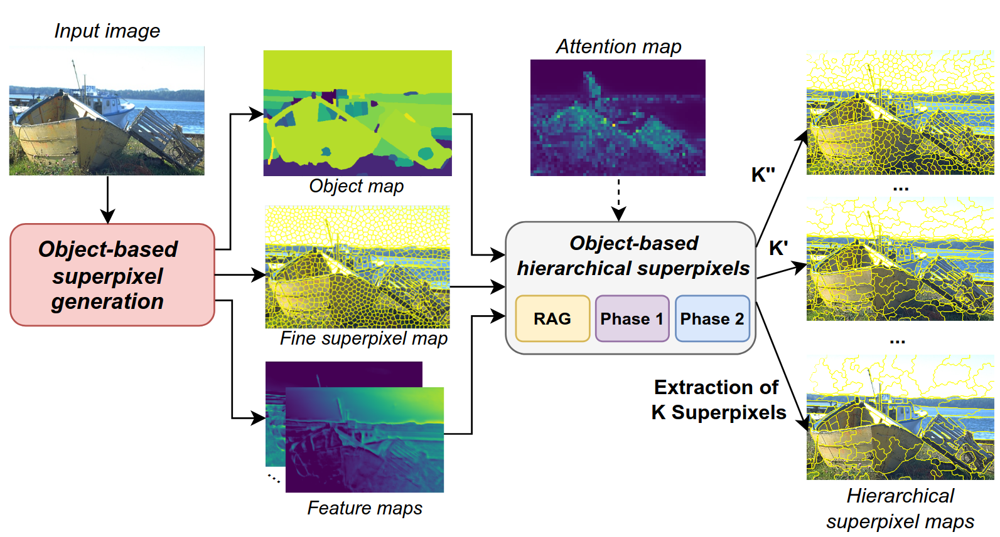
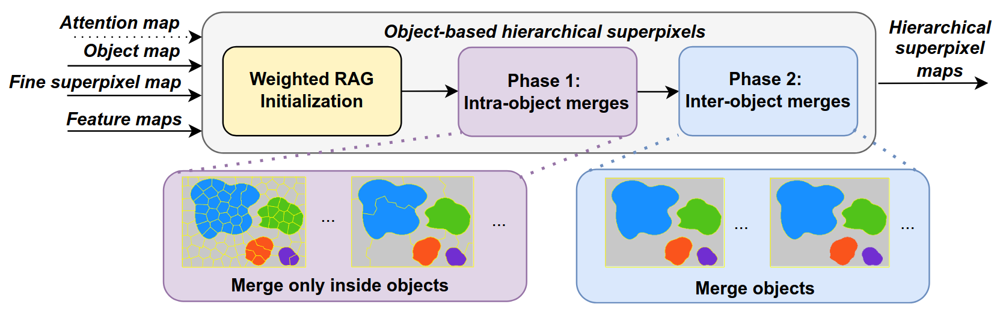

# H-SPAM: Hierarchical Superpixel Anything Model 

Official implementation of Hierarchical Superpixel Model

This repo is based on the pytorch implementation of the Superpixel Anything Model ([SPAM](https://github.com/waldo-j/spam))




## 1) Requirements

```bash
pip install -r requirements.txt
```
## 2) Dataset
- Download BSDS500 here:
https://www2.eecs.berkeley.edu/Research/Projects/CS/vision/grouping/resources.html

- Download sam_vit_h here:
https://dl.fbaipublicfiles.com/segment_anything/sam_vit_h_4b8939.pth

- The model checkpoint can be found in spam/SPAM/models/spam_checkpoint.pt

Place the data like this:

```
hspam
├── data
│   └── BSD
        └── data
            ├── groundTruth
            │   ├── test
            │   ├── train
            │   └── val
            └── images
                ├── test
                ├── train
                └── val

├── README.md
├── requirements.txt
├── HSPAM
    └── SAM
        └──sam_vit_h_4b8939.pth
    └── models
        └──spam_checkpoint.pt

```


## 3) Inference 
### a) Image Mode
Try model on a single image. This mode save the full hierarchy.

***Minimal Command***
```
python inference.py --image /path/to/image  \
                    --use_sam \
                    --nspix 1250
```
***Visual Attention mode***: Guide the hierarchy using visual attention

```
python inference.py --image /path/to/image \
                    --checkpoint path_to_weight \
                    --use_sam \
                    --nspix 1250 \
                    --w_att 2

```
***Interractive mode***: Guide the hierarchy with user clicks
```
python inference.py --image /path/to/image \
                    --use_sam \
                    --nspix 1250 \
                    --w_att 2 \
                    --interactive
```
### b) Folder Mode
Run a range of superpixel counts over a folder or the full BSD dataset. The following are saved:

- Image with superpixel overlay (.png)

- Superpixel labels (.npy)

- Final object map after processing (.png)

***Minimal Command***
```
python inference.py --folder /path/to/folder  \
                    --use_sam \
                    --out_folder /path/to/save/folder \
                    --np_range 50 150 250 350 500 650 800 1000 1250 
```
## 5) Notes on main options

- ```--w_pos```: Influence the importance of spatial features

- ```--use_sam```: use SAM masks as object prior

- ```--use_fastsam``` : use FastSAM masks as object prior

- ```--use_dino```: enable attention guidance

- ```--ratio```: scales superpixel allocation per object under attention guidance

- ```--nspix```: target number of superpixels for image mode

- ```--np_range```: list of target counts for batch runs in folder mode

- ```--w_att```: Influence the importance of attention. Default is 0. If w_att> 0 enable the attention mode. If w_att =0 the attention is disable
- ```--interactive```: enable the interactive mode. User must click on objects of interest 


## 5) Citing Hierarchical Superpixel Anything Model
Comming 